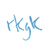

A better Pixiv browser.

## Requirements
- Elm 0.18
- Ruby 2.x
- `gem`

## Installing
```
sed -i .bak -e "s/USERNAME/your pixiv username/" -e "s/PASSWORD/your pixiv password" Main.elm
make
bundle install
rackup
```
Navigate to `localhost:9292` in your browser.

## Documentation
```
make docs
```
Navigate to [the Elm doc previewer](http://package.elm-lang.org/help/docs-preview) and select `documentation.json`.

## Plans for the future
- Rewrite UI using elm-lang/navigation
- Support for opening tabs
- Browsing and managing follows, bookmarks, etc
- Release Pixiv.elm as a standalone library
- Saving illustrations and whole artists pages offline
- Better proxy
- Distribute as a binary

## Contributing
I like to think the source is pretty straightforward. You can take a look for yourself once you're done laughing.
